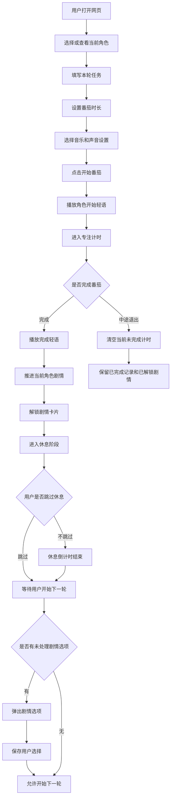
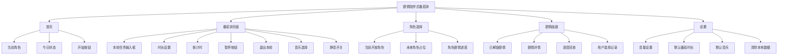

# 番茄轻语 PRD v0.1

# 第0部分：文档信息

## 0.1 基本信息

| 字段 | 内容 |
|---|---|
| 文档名称 | 剧情陪伴式番茄钟 PRD |
| 当前版本 | v0.1 |
| 当前阶段 | 初稿到中稿 |
| 产品形态 | 网页应用 |
| 文档作者 | TBD |
| 创建日期 | TBD |
| 最近更新日期 | TBD |
| 目标上线版本 | MVP 第一版 |

## 0.2 版本更新记录

| 版本 | 阶段 | 更新时间 | 更新内容 | 负责人 |
|---|---|---|---|---|
| v0.1 | 初稿到中稿 | TBD | 根据需求讨论整理第一版 PRD | TBD |

## 0.3 需求状态说明

| 状态 | 含义 |
|---|---|
| 已确认 | 已经在讨论中明确 |
| TBD | 待确定，后续需要补充 |
| 暂不做 | 第一版明确不做，后续可评估 |

# 第一部分：需求背景与目标

对应阶段：初稿  
核心内容：为什么要做、为谁做、解决什么问题

## 1.1 产品一句话说明

一个带有虚拟角色陪伴和剧情解锁机制的网页番茄钟应用，用户通过完成番茄钟推进角色剧情，从而降低学习启动阻力。

## 1.2 需求背景

很多用户知道自己应该学习或工作，但真正开始很难。

常见问题包括：

1. 打开书或项目之前很抗拒。
2. 普通番茄钟太工具化，缺少陪伴感。
3. 一个人学习容易无聊，很难持续。
4. 用户需要一个“想再打开一次”的理由。

本产品希望通过虚拟角色、轻语、音乐、剧情解锁和彩蛋选项，让用户因为想看后续剧情而启动番茄钟。

一旦番茄钟启动，用户就进入一段真实学习时间。

## 1.3 目标用户

| 用户类型 | 典型场景 | 核心痛点 |
|---|---|---|
| 学生 | 写作业、复习、备考 | 难开始，容易分心 |
| 自学者 | 学编程、学语言、看课程 | 缺少陪伴和反馈 |
| 做项目的人 | 写代码、改 bug、整理资料 | 任务启动困难 |
| 轻度拖延用户 | 明知道要做事但迟迟不开始 | 缺少启动钩子 |

## 1.4 核心目标

### 业务目标

1. 验证“剧情陪伴”能不能让用户更愿意启动番茄钟。
2. 验证“完成番茄后解锁剧情”能不能带来持续使用动力。
3. 跑通网页端第一版核心功能。

### 用户目标

1. 用户能快速写下本轮任务。
2. 用户能启动一个至少 25 分钟的番茄钟。
3. 用户能在角色轻语和音乐陪伴下进入学习状态。
4. 用户完成番茄后能获得剧情奖励。
5. 用户能在画廊回看已解锁剧情。

## 1.5 第一版验证重点

第一版重点验证：

**用户会不会因为想知道后续剧情而启动番茄钟，并完成一段真实学习时间。**

## 1.6 第一版不做范围

| 功能 | 第一版状态 | 原因 |
|---|---|---|
| 实时 AI 聊天 | 暂不做 | 成本和体验不可控 |
| 实时 AI 语音生成 | 暂不做 | 第一版使用固定音频即可验证核心体验 |
| 复杂剧情树 | 暂不做 | 先做轻分支，避免内容复杂度过高 |
| 账号系统 | 暂不做 | 第一版用 localStorage 保存进度 |
| 云同步 | 暂不做 | 第一版先做本地体验 |
| 付费系统 | 暂不做 | 当前目标是验证核心功能 |
| 好友系统 | 暂不做 | 会明显增加开发范围 |
| 排行榜 | 暂不做 | 和陪伴学习氛围不完全匹配 |
| 多角色完整内容 | 暂不做 | 第一版预留入口，先开放少量角色或一个角色 |

# 第二部分：方案概述

对应阶段：中稿  
核心内容：业务流程、功能流程、信息架构

## 2.1 产品核心机制

用户完成一个番茄钟，推进一次当前角色剧情。

规则：

1. 番茄钟最低 25 分钟。
2. 用户可以自定义 25 分钟以上的时长。
3. 50 分钟也算 1 次番茄，只推进 1 次剧情。
4. 完成一次有效番茄后，当前角色剧情进度推进 1 次。
5. 不同角色的剧情进度独立保存。
6. 中途退出时，已完成记录保留，未完成计时清空。
7. 没有失败功能。
8. 没有失败剧情。
9. 刷新页面不影响当前番茄钟时间。
10. 允许暂停，暂不限制暂停次数。
11. 切换标签页不限制。
12. 支持静音模式。
13. 支持音乐选择。
14. 第一版需要本轮任务输入框。
15. 已解锁剧情可以在画廊回看。

## 2.2 用户主流程



## 2.3 核心功能流程

### 2.3.1 开始番茄流程

1. 用户进入首页。
2. 查看当前角色和当前剧情状态。
3. 输入本轮任务。
4. 设置番茄时长，最低 25 分钟。
5. 选择音乐。
6. 选择是否静音。
7. 点击开始。
8. 播放角色开始语音，静音模式下只显示文字。
9. 倒计时开始。

### 2.3.2 完成番茄流程

1. 倒计时结束。
2. 播放角色完成语音，静音模式下只显示文字。
3. 当前角色完成番茄数加 1。
4. 当前角色剧情进度推进 1 次。
5. 解锁新剧情。
6. 新剧情进入画廊。
7. 进入休息阶段。

### 2.3.3 休息和彩蛋选项流程

1. 完成番茄后进入休息。
2. 用户可以正常等待休息结束。
3. 用户也可以跳过休息。
4. 如果存在休息结束后的剧情选项，不在跳过休息时立刻弹出。
5. 用户点击“开始下一轮”时，系统先检查是否存在未处理剧情选项。
6. 如果存在，则先弹出选项。
7. 用户完成选择后，系统保存选择记录。
8. 用户才可以开始下一轮番茄。

## 2.4 信息架构



## 2.5 页面列表

| 页面或模块 | 第一版是否需要 | 说明 |
|---|---|---|
| 首页 | 需要 | 展示当前角色、状态、开始入口 |
| 番茄钟页面 | 需要 | 核心计时与学习页面 |
| 角色选择入口 | 需要 | 第一版预留，至少展示当前角色 |
| 剧情画廊 | 需要 | 回看已解锁剧情 |
| 设置面板 | 需要 | 音量、静音、音乐、默认时长 |
| 登录页 | 暂不做 | 第一版无账号 |
| 付费页 | 暂不做 | 第一版不做商业化 |

# 第三部分：细节方案

对应阶段：定稿  
核心内容：交互说明、边缘情况、非功能需求

## 3.1 番茄钟规则

| 规则项 | 规则 |
|---|---|
| 最短时长 | 25 分钟 |
| 自定义时长 | 允许，必须大于等于 25 分钟 |
| 50 分钟计算方式 | 算 1 次番茄 |
| 剧情推进 | 完成 1 次番茄，推进 1 次剧情 |
| 暂停 | 允许，暂不限制次数 |
| 切换标签页 | 不限制 |
| 刷新页面 | 不影响当前番茄钟时间 |
| 中途退出 | 当前未完成计时清空 |
| 失败状态 | 无失败状态 |
| 失败剧情 | 不做 |

## 3.2 本轮任务输入框

### 功能说明

用户开始番茄前，需要填写本轮要完成的任务。

示例：

1. 背 20 个单词。
2. 写完项目首页。
3. 看完 Java 第 3 节。
4. 整理一页笔记。
5. 修复登录按钮 bug。

### 交互规则

| 场景 | 规则 |
|---|---|
| 用户未填写任务 | 是否允许开始 TBD |
| 输入字数限制 | TBD |
| 是否保存历史任务 | TBD |
| 是否展示本轮任务在计时页 | 建议展示 |
| 完成后是否记录本轮任务 | 建议记录到本地完成记录 |

## 3.3 角色系统

### 第一版规则

1. 第一版角色方向为同学或学姐。
2. 剧情风格先做校园陪伴和轻恋爱。
3. 后期可以扩展多角色、多剧情风格。
4. 第一版预留角色切换入口。
5. 多角色剧情进度独立保存。
6. 角色立绘由用户自己插入。

### 角色数据建议

```json
{
  "characterId": "senpai_001",
  "characterName": "学姐",
  "roleType": "senpai",
  "style": "校园陪伴, 轻恋爱",
  "portrait": "/images/characters/senpai/normal.png",
  "isAvailable": true,
  "storyProgress": 0,
  "completedPomodoros": 0
}
```

## 3.4 剧情系统

### 剧情触发点

| 触发点 | 是否需要 | 说明 |
|---|---|---|
| 番茄开始 | 需要 | 播放开始轻语，显示文字台词 |
| 番茄进行中 | 暂不做强互动 | 避免打断专注 |
| 番茄完成 | 需要 | 播放完成轻语，解锁剧情 |
| 休息结束后 | 可选 | 可触发剧情选项 |
| 开始下一轮前 | 需要检查 | 如果有未处理剧情选项，必须先处理 |

### 剧情数据建议

```json
{
  "episodeId": "senpai_ep_001",
  "characterId": "senpai_001",
  "requiredPomodoros": 1,
  "title": "第一次一起自习",
  "startLine": "这 25 分钟我也会看书，我们一起开始吧。",
  "startVoice": "/audio/voice/senpai/start-001.mp3",
  "endLine": "你真的完成了。那我也告诉你一个小秘密吧。",
  "endVoice": "/audio/voice/senpai/end-001.mp3",
  "unlockText": "她在窗边的位置给你留了一本书。",
  "pendingChoiceTiming": "before_next_pomodoro",
  "choices": [
    {
      "choiceId": "a",
      "text": "什么秘密？",
      "reply": "先休息一下，回来我再告诉你。"
    },
    {
      "choiceId": "b",
      "text": "我已经猜到了。",
      "reply": "那你回来以后说给我听。"
    }
  ]
}
```

## 3.5 音频系统

### 第一版规则

1. 使用固定音频。
2. 不做实时 AI 语音生成。
3. 支持静音模式。
4. 支持音乐选择。
5. 语音失败不影响计时。
6. 音乐失败不影响计时。

### 音频类型

| 类型 | 说明 |
|---|---|
| 角色开始语音 | 番茄开始时播放 |
| 角色完成语音 | 番茄完成时播放 |
| 剧情语音 | 解锁剧情时播放，是否需要 TBD |
| 背景音乐 | 专注时播放 |
| 休息提示音 | 是否需要 TBD |

### 音乐类型

第一版建议支持：

1. 雨声。
2. 白噪音。
3. 轻柔音乐。

### 文件结构建议

```txt
public/audio/voice/
public/audio/music/
public/images/characters/
```

## 3.6 静音模式

### 规则

1. 静音模式关闭角色语音。
2. 静音模式关闭背景音乐。
3. 静音模式下文字剧情照常显示。
4. 静音模式下番茄钟照常运行。
5. 静音模式下剧情照常解锁。

## 3.7 休息规则

| 规则项 | 规则 |
|---|---|
| 是否必须休息 | 不必须 |
| 是否可以跳过 | 可以 |
| 跳过休息后是否立刻弹剧情选项 | 不立刻弹 |
| 未处理剧情选项什么时候弹 | 用户点击开始下一轮时 |
| 选项是否能跳过 | 不能跳过 |
| 选完后是否才能开始下一轮 | 是 |

## 3.8 画廊规则

### 功能说明

画廊用于展示用户已经解锁的剧情，强化学习成果感。

### 第一版展示内容

| 内容 | 是否展示 |
|---|---|
| 剧情标题 | 需要 |
| 角色名字 | 需要 |
| 解锁时间 | 需要 |
| 剧情文本 | 需要 |
| 用户当时的选择 | 建议展示 |
| 语音回放按钮 | 建议展示 |
| 角色立绘 | 需要预留 |

## 3.9 localStorage 保存内容

第一版使用 localStorage 保存进度。

建议保存内容：

```json
{
  "currentCharacterId": "senpai_001",
  "settings": {
    "defaultFocusMinutes": 25,
    "breakMinutes": 5,
    "musicId": "rain_001",
    "voiceVolume": 0.7,
    "musicVolume": 0.25,
    "muted": false
  },
  "timerState": {
    "status": "idle",
    "taskText": "",
    "focusMinutes": 25,
    "startTime": null,
    "endTime": null,
    "pausedAt": null,
    "totalPausedMs": 0
  },
  "characters": {
    "senpai_001": {
      "completedPomodoros": 0,
      "storyProgress": 0,
      "unlockedEpisodeIds": [],
      "pendingChoiceEpisodeId": null,
      "choiceRecords": []
    }
  },
  "gallery": []
}
```

## 3.10 计时技术规则

为了保证刷新页面不影响计时，不能只做每秒减 1。

需要保存：

1. startTime。
2. endTime。
3. status。
4. pausedAt。
5. totalPausedMs。

剩余时间通过当前真实时间和 endTime 计算。

## 3.11 状态定义

| 状态 | 含义 |
|---|---|
| idle | 未开始 |
| focusing | 专注中 |
| paused | 暂停中 |
| completed | 番茄完成 |
| break | 休息中 |
| pendingChoice | 有未处理剧情选项 |
| story | 展示剧情中 |

## 3.12 边缘情况

| 场景 | 处理方式 |
|---|---|
| 中途关闭网页 | 当前未完成番茄清空，已完成记录保留 |
| 刷新页面 | 根据保存的时间恢复当前番茄状态 |
| 暂停后刷新 | 保留暂停状态和剩余时间 |
| 切换标签页 | 不限制，不影响解锁 |
| 音频加载失败 | 显示文字，计时继续 |
| 音乐加载失败 | 静音继续，计时继续 |
| 静音模式 | 文字照常，声音关闭 |
| localStorage 被清除 | 进度丢失，是否提示用户 TBD |
| 角色图片缺失 | 使用默认占位图，具体占位图 TBD |
| 没有更多剧情 | 显示通用完成语，后续处理 TBD |
| 用户不填写任务 | 是否允许开始 TBD |
| 用户设置低于 25 分钟 | 阻止开始，并提示最低 25 分钟 |
| 用户跳过休息 | 允许跳过，但未处理剧情选项保留 |
| 用户开始下一轮前有剧情选项 | 必须先选择，选择后才能开始 |

## 3.13 非功能需求

| 类型 | 要求 |
|---|---|
| 性能 | 页面首次加载速度 TBD |
| 兼容性 | 现代浏览器，具体范围 TBD |
| 响应式 | 建议支持电脑和手机浏览器 |
| 可访问性 | 静音模式下必须能完整阅读文字 |
| 数据安全 | 第一版数据保存在本地浏览器 |
| 版权 | 音频、音乐、立绘需要可用授权，具体来源 TBD |
| 稳定性 | 计时不应因为刷新而丢失 |
| 可扩展性 | 角色、剧情、音频使用配置化数据 |

# 第四部分：上线计划

对应阶段：定稿  
核心内容：排期、灰度发布

## 4.1 开发阶段拆分

| 阶段 | 目标 | 功能范围 | 状态 |
|---|---|---|---|
| 第 1 阶段 | 跑通核心番茄钟 | 计时、暂停、刷新恢复、退出清空 | TBD |
| 第 2 阶段 | 跑通剧情解锁 | 开始台词、完成台词、剧情推进、画廊 | TBD |
| 第 3 阶段 | 跑通声音体验 | 固定语音、音乐选择、静音模式 | TBD |
| 第 4 阶段 | 跑通角色结构 | 当前角色、角色入口、多角色独立进度结构 | TBD |
| 第 5 阶段 | 内测优化 | 边缘情况、样式、体验修正 | TBD |

## 4.2 建议开发任务清单

### P0 必须完成

1. 网页基础页面。
2. 本轮任务输入框。
3. 番茄钟最低 25 分钟限制。
4. 自定义时长。
5. 开始、暂停、继续、退出。
6. 刷新后恢复计时。
7. 完成番茄后推进剧情。
8. localStorage 保存进度。
9. 固定语音播放。
10. 静音模式。
11. 音乐选择。
12. 画廊回看。
13. 休息可跳过。
14. 开始下一轮前处理未完成剧情选项。

### P1 建议完成

1. 角色切换入口占位。
2. 用户选择记录。
3. 语音回放。
4. 默认角色图占位。
5. 音量设置。
6. 当前任务完成记录。

### P2 后续考虑

1. 多角色正式开放。
2. 更多剧情。
3. 更多音乐。
4. 成就系统。
5. 数据导出和导入。
6. 账号和云同步。
7. 付费系统。
8. AI 聊天。
9. AI 语音生成。

## 4.3 测试计划

| 测试项 | 测试方法 | 是否通过 |
|---|---|---|
| 25 分钟以下不能开始 | 输入 10 分钟并点击开始 | TBD |
| 25 分钟可以开始 | 输入 25 分钟并点击开始 | TBD |
| 50 分钟只算 1 次番茄 | 完成 50 分钟后查看记录 | TBD |
| 刷新后时间正确 | 专注中刷新页面 | TBD |
| 暂停后刷新正确 | 暂停状态刷新页面 | TBD |
| 中途退出清空本轮 | 专注中退出本轮 | TBD |
| 完成后剧情推进 | 完成一轮番茄 | TBD |
| 休息可跳过 | 完成后点击跳过休息 | TBD |
| 未处理选项不能跳过 | 开始下一轮前检查弹窗 | TBD |
| 静音模式不播放声音 | 开启静音后开始番茄 | TBD |
| 画廊能回看剧情 | 完成番茄后进入画廊 | TBD |
| 多角色进度独立 | 切换角色后检查进度 | TBD |

## 4.4 灰度发布计划

| 阶段 | 用户范围 | 目标 | 观察指标 |
|---|---|---|---|
| 内部自测 | 开发者自己 | 找明显 bug | 计时是否稳定，剧情是否推进 |
| 小范围测试 | 3 到 5 个熟人 | 验证是否能完整使用 | 是否完成至少 1 个番茄 |
| 第一轮灰度 | 10 到 20 个用户 | 验证剧情是否带动启动 | 次日是否回来，画廊是否被查看 |
| 第二轮灰度 | TBD | 根据反馈扩大 | TBD |

## 4.5 核心验证指标

| 指标 | 含义 | 目标值 |
|---|---|---|
| 首次启动率 | 打开网页后点击开始番茄的比例 | TBD |
| 首次完成率 | 第一次启动后完成番茄的比例 | TBD |
| 次日返回率 | 第二天再次打开的比例 | TBD |
| 剧情查看率 | 完成番茄后查看剧情的比例 | TBD |
| 画廊查看率 | 用户是否主动看已解锁剧情 | TBD |
| 平均完成番茄数 | 每个用户平均完成次数 | TBD |
| 静音模式使用率 | 判断用户声音使用场景 | TBD |

## 4.6 上线风险

| 风险 | 说明 | 应对 |
|---|---|---|
| 用户觉得剧情打扰学习 | 剧情太频繁会破坏专注 | 专注中不弹强互动 |
| 音频版权问题 | 固定语音和音乐需要授权 | 使用可商用资源并记录来源 |
| 内容不够 | 剧情太少会很快消耗完 | 第一版先准备小规模完整剧情 |
| localStorage 丢数据 | 用户清缓存会丢进度 | 第一版提示风险，后续做导出 |
| 轻恋爱台词尴尬 | 台词过度会劝退用户 | 使用克制、陪伴、学习约定风格 |
| 计时不准 | 页面休眠或刷新可能影响倒计时 | 用真实时间计算剩余时间 |

## 4.7 待确定问题清单

1. 产品正式名称 TBD。
2. 第一版开放几个角色 TBD。
3. 第一个角色姓名 TBD。
4. 第一版准备多少段剧情 TBD。
5. 第一版准备多少条固定语音 TBD。
6. 休息默认时长 TBD。
7. 用户未填写本轮任务时是否允许开始 TBD。
8. 本轮任务输入字数限制 TBD。
9. 是否保存历史任务 TBD。
10. 剧情语音是否和开始、完成语音分开 TBD。
11. 角色立绘文件格式 TBD。
12. 默认音乐列表 TBD。
13. 音频素材来源和授权 TBD。
14. 浏览器兼容范围 TBD。
15. 部署平台 TBD。
16. 第一轮测试用户数量 TBD。
17. MVP 完成时间 TBD。


1. 产品正式名称 TBD。番茄轻语 2. 第一版开放几个角色 TBD。一个 3. 第一个角色姓名 TBD。 4. 第一版准备多少段剧情 TBD。待定 5. 第一版准备多少条固定语音 TBD。待定 6. 休息默认时长 TBD。5 分钟 7. 用户未填写本轮任务时是否允许开始 TBD。任务可为空 8. 本轮任务输入字数限制 TBD。15 个字 9. 是否保存历史任务 TBD。保存 10. 剧情语音是否和开始、完成语音分开 TBD。其实开始、完成语音也算是剧情语音，不一定个番茄钟都要有开始结束语音 11. 角色立绘文件格式 TBD。都行 12. 默认音乐列表 TBD。雨天，咖啡馆，篝火 13. 音频素材来源和授权 TBD。我自己下载，先不管 14. 浏览器兼容范围 TBD。基本最近几年的浏览器都能使（优先兼容谷歌） 15. 部署平台 TBD。就浏览器 16. 第一轮测试用户数量 TBD。就我自己 17. MVP 完成时间 TBD。待定 18. 第一版角色名称和人设 名称：岁岁 人设：温柔，可爱，聪明，声音好听 19.设计风格 暖色软极简风格
# 附录 A：第一版产品边界总结

第一版只做一件事：

**让用户因为想看角色剧情而启动番茄钟，并完成至少 25 分钟的真实学习。**

第一版不追求复杂系统，先追求完整闭环：


# 附录 B：开发优先级建议

最先开发顺序：

1. 番茄钟计时。
2. localStorage 保存和刷新恢复。
3. 本轮任务输入框。
4. 固定剧情 JSON。
5. 完成后剧情推进。
6. 画廊。
7. 音频播放和静音。
8. 音乐选择。
9. 休息和未处理选项。
10. 角色入口占位。

